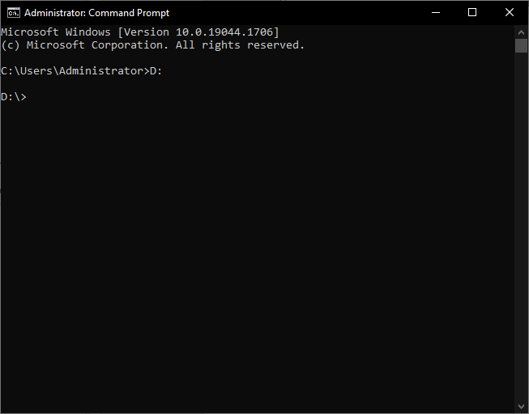
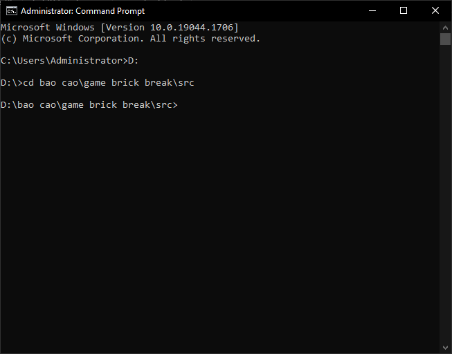
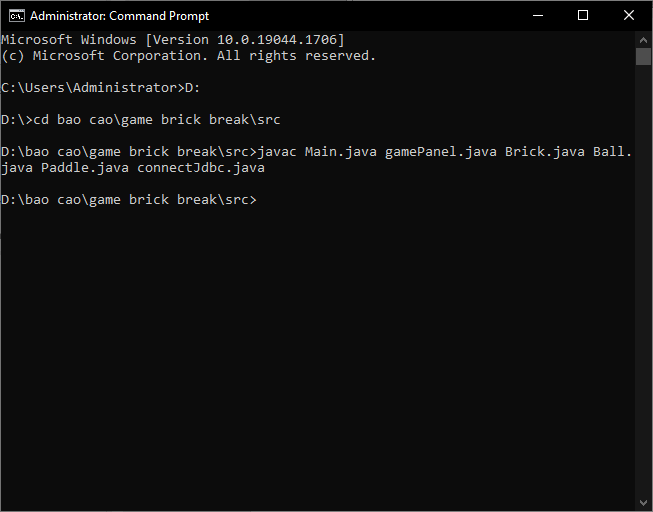
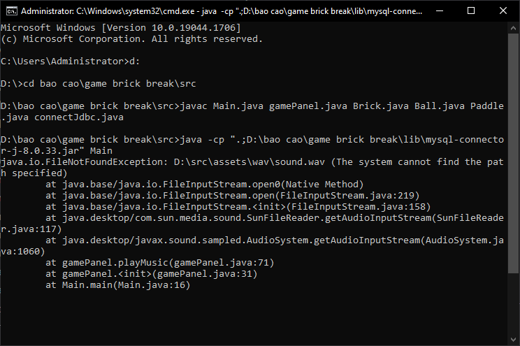

# Game Brick Breaker
# Giới thiệu

- Game Brick Breaker là một trò chơi điện tử phổ biến, được phát triển vào những năm 1970 và 1980 và trở thành một trò chơi kinh điển trong lịch sử của ngành công nghiệp game. Trong trò chơi này, người chơi điều khiển một thanh đỡ ở dưới màn hình để điều khiển một quả bóng tròn và sử dụng nó để phá hủy các khối gạch được xếp chồng lên nhau trên màn hình. Mục tiêu của người chơi là phá hủy tất cả các khối gạch mà không để quả bóng rơi xuống đất.
# Công nghệ được sử dụng để phát triển trò chơi  
1. Java (JDK 8+) 
2. JDBC để kết nối với cơ sở dữ liệu MySQL.
# Cách chơi: 
1. Khi bắt đầu trò chơi, người chơi cần nhập tên của mình. 
2. Người chơi sử dụng hai phím điều hướng trái, phải để di chuyển thanh đỡ. 
3. Sử dụng phím space để bắt đầu, tạm dừng hoặc tiếp tục trò chơi.
# Khởi tạo cơ sở dữ liệu
- Bước 1: trước tiên cần mở MySQL Command Prompt hoặc MySQL Workbench
- Bước 2: đăng nhập với tư cách quản trị viên (nhập mật khẩu nếu được yêu cầu)
- Bước 3: Sau đó, sao chép và dán các lệnh MySQL sau để tạo cơ sở dữ liệu và bảng dữ liệu:
>- create database quanlydiem;
>- use quanlydiem;
>-  CREATE TABLE scores (
>- id INT AUTO_INCREMENT PRIMARY KEY,
>- player_name VARCHAR(45) NOT NULL,
>- score INT NOT NULL,
>- level INT NOT NULL
> );
# Trước khi chạy game cần đổi cổng,user name,passworld trong connectJdbc.java
# Cách để chạy trên máy chỉ có JDk

- Bước 1: Cần chuyển về thư mục chứa file
ở đây là ổ D
> D:
- 
-Bước 2: Gõ lệnh sau
> Cd bao cao\game brick break\src
- 
- Bước 3: Gõ tiếp
>javac Main.java gamePanel.java Brick.java Ball.java Paddle.java connectJdbc.java
- 
- Bước 4:Gõ lệnh sau để chạy
> java -cp ".;ổ đĩa\bao cao\game brick break\lib\mysql-connector-j-8.0.33.jar" Main
- ở đây là ổ D
> java -cp ".;D:\bao cao\game brick break\lib\mysql-connector-j-8.0.33.jar" Main

- 
